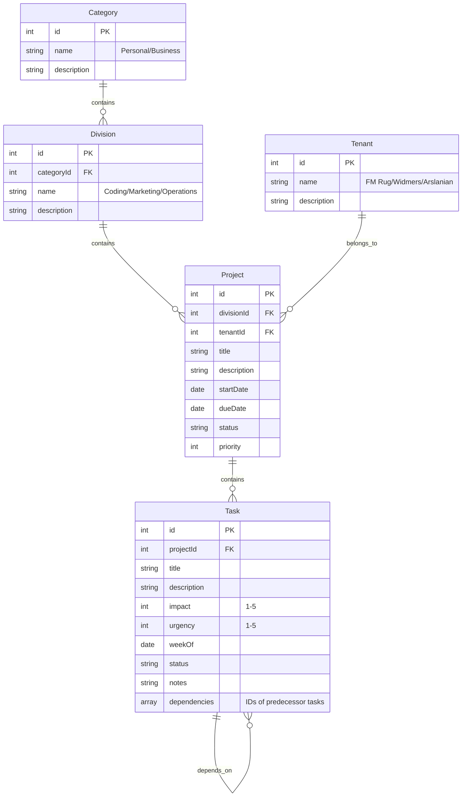
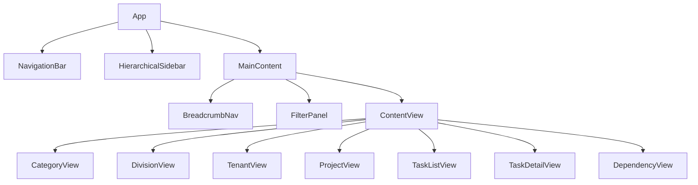

# Comprehensive Task Management System Implementation Plan

## Overview

This document outlines the implementation plan for a comprehensive task management system with hierarchical organization. The system will support both Personal and Business categories, with Business further divided into Coding/Development, Marketing, and Operations divisions. Each division will support client-specific projects with the ability to track progress, set deadlines, assign priorities, and visualize dependencies between tasks.

## 1. Data Model Redesign



## 2. UI Components

### 2.1 Hierarchical Navigation
- Tree-view sidebar for navigating through the hierarchy
- Breadcrumb navigation at the top of content area
- Quick access buttons for frequently accessed views

### 2.2 Advanced Filter Panel
- Multi-select dropdowns for each hierarchy level
- Filter by status, priority, due date
- Save and load filter presets
- Persistent filters using localStorage

### 2.3 Task Dependency Visualization
- Simple predecessor/successor relationship display
- Visual indicators in task list for dependent tasks
- Dependency graph view for complex projects

## 3. Implementation Phases

### Phase 1: Database Schema Update
- Create new Dexie.js database with the updated schema
- Initialize with default categories (Personal, Business)
- Initialize with default divisions (Coding, Marketing, Operations)
- Initialize with default tenants (FM Rug, Widmers, Arslanian)

### Phase 2: Core UI Components
- Implement hierarchical navigation sidebar
- Create breadcrumb navigation component
- Develop advanced filtering functionality

### Phase 3: Task Management Enhancements
- Update task form to support the new hierarchy
- Implement dependency selection and visualization
- Add validation for circular dependencies

### Phase 4: Advanced Features
- Implement persistent filters
- Add batch operations for tasks
- Create summary views and dashboards

## 4. Technical Implementation Details

### 4.1 Database Schema (Dexie.js)

```typescript
export class EnhancedPriorityDB extends Dexie {
  categories!: Table<Category>;
  divisions!: Table<Division>;
  tenants!: Table<Tenant>;
  projects!: Table<Project>;
  tasks!: Table<Task>;

  constructor() {
    super('EnhancedPriorityDatabase');
    this.version(1).stores({
      categories: '++id, name',
      divisions: '++id, categoryId, name',
      tenants: '++id, name',
      projects: '++id, divisionId, tenantId, status, dueDate',
      tasks: '++id, projectId, status, weekOf, impact, urgency'
    });
  }
}
```

### 4.2 Component Structure



### 4.3 State Management

- Use React Context for global state management
- Implement custom hooks for hierarchy navigation
- Create utility functions for filtering and sorting
- Use localStorage for persistent filter settings

## 5. Testing Strategy

1. Unit tests for data models and utility functions
2. Component tests for UI elements
3. Integration tests for database operations
4. End-to-end tests for critical user flows
5. Performance testing for large datasets