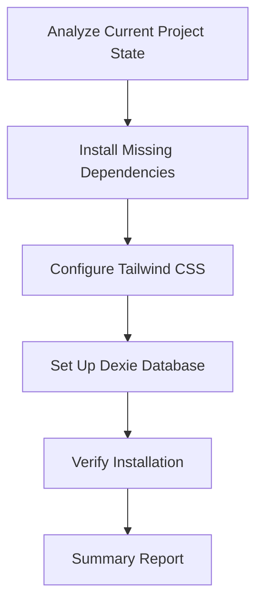
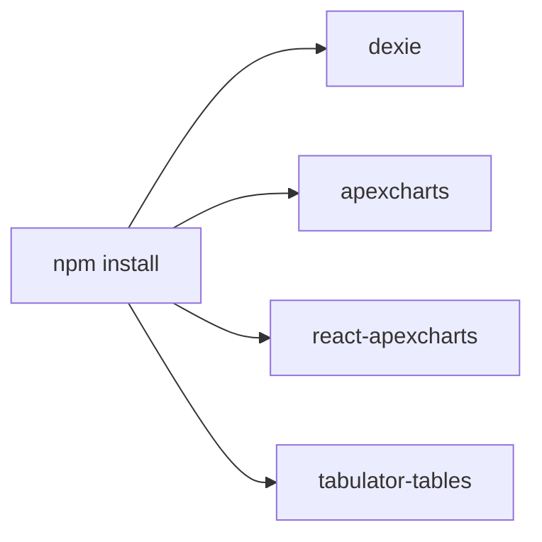
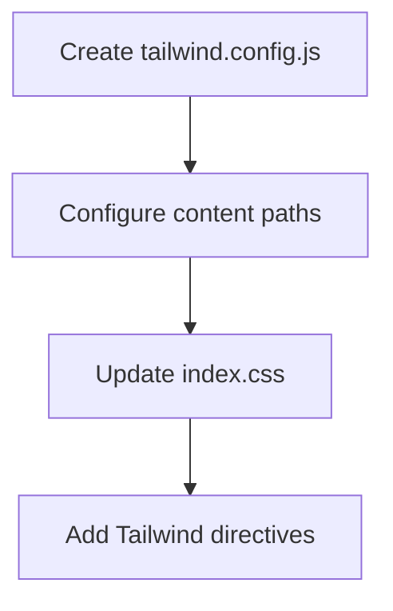
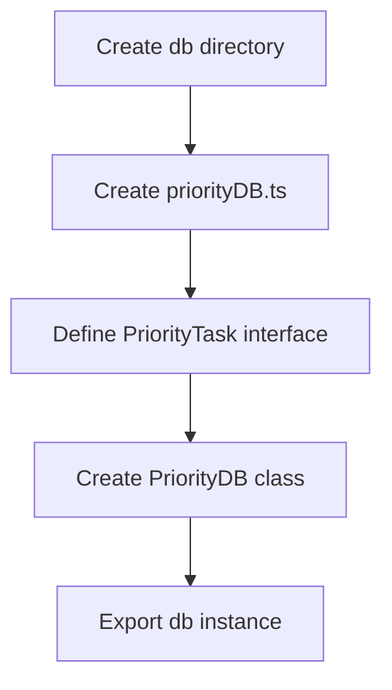

# Priority Tracker Project Setup Plan

## Project Context Summary

The Priority Tracker is a self-hosted, local-first priority tracking app for strategic and operational planning with the following characteristics:
- Built with Vite + React (TypeScript)
- Uses Tailwind CSS for styling
- Uses Dexie.js for local database (IndexedDB wrapper)
- Includes ApexCharts for visualization and Tabulator.js for data tables
- Designed to track tasks by priority category (Primary, Strategic, Ongoing)

## Current Project State

- Basic Vite + React + TypeScript project initialized
- React dependencies installed (react, react-dom)
- Some dev dependencies installed (autoprefixer, postcss, tailwindcss)
- Default Vite template structure in place
- Missing proper Tailwind configuration
- Missing Dexie.js and other required dependencies

## Implementation Plan



### 1. Install Missing Dependencies

We need to install the following dependencies:

- **Core Dependencies:**
  - `dexie` - IndexedDB wrapper for local database

- **Optional Dependencies (as requested):**
  - `apexcharts` and `react-apexcharts` - For visualization
  - `tabulator-tables` - For data tables



### 2. Configure Tailwind CSS

Tailwind CSS is already installed but needs proper configuration:

- Create `tailwind.config.js` file with proper content paths
- Update `src/index.css` to include Tailwind directives



### 3. Set Up Dexie Database

Create the database structure as outlined in the build guide:

- Create `src/db` directory
- Create `src/db/priorityDB.ts` file with the database schema



### 4. Verify Installation

After installing all dependencies and configuring the environment:

- Check package.json to verify all dependencies are installed
- Verify Tailwind CSS configuration
- Verify Dexie database setup

### 5. Summary Report

Create a summary report of:
- Project context
- Installed dependencies
- Newly installed dependencies
- Configuration changes made

## Detailed Steps

1. **Install Missing Dependencies**
   - Run `npm install dexie apexcharts react-apexcharts tabulator-tables`

2. **Configure Tailwind CSS**
   - Create `tailwind.config.js` with content paths: `["./index.html", "./src/**/*.{js,ts,jsx,tsx}"]`
   - Update `src/index.css` to include Tailwind directives:
     ```css
     @tailwind base;
     @tailwind components;
     @tailwind utilities;
     ```

3. **Set Up Dexie Database**
   - Create `src/db` directory
   - Create `src/db/priorityDB.ts` with the database schema as specified in the build guide:
     ```typescript
     import Dexie, { Table } from 'dexie';

     export interface PriorityTask {
       id?: number;
       title: string;
       category: 'Primary' | 'Strategic' | 'Ongoing';
       impact: number;
       urgency: number;
       tenant: string;
       status: 'Planned' | 'In Progress' | 'Done';
       weekOf: string;
       notes?: string;
     }

     export class PriorityDB extends Dexie {
       tasks!: Table<PriorityTask>;
       constructor() {
         super('PriorityDatabase');
         this.version(1).stores({
           tasks: '++id, weekOf, category, tenant, status'
         });
       }
     }

     export const db = new PriorityDB();
     ```

4. **Verify Installation**
   - Check package.json to verify all dependencies are installed
   - Verify Tailwind CSS configuration
   - Verify Dexie database setup

## Expected Outcome

After completing these steps, the Priority Tracker project will have:
1. All required dependencies installed
2. Tailwind CSS properly configured
3. Dexie database structure set up

The project will be ready for development of UI components and functionality as outlined in the project scope.